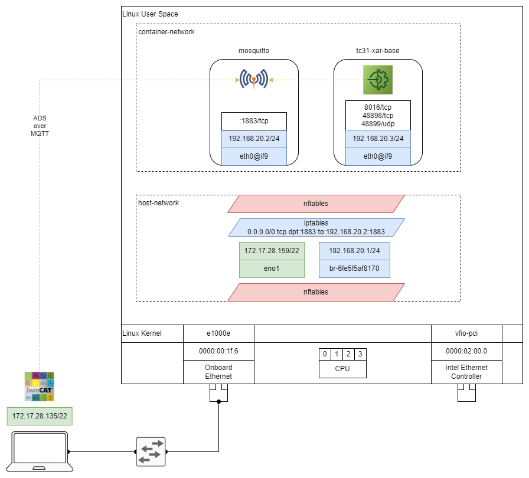
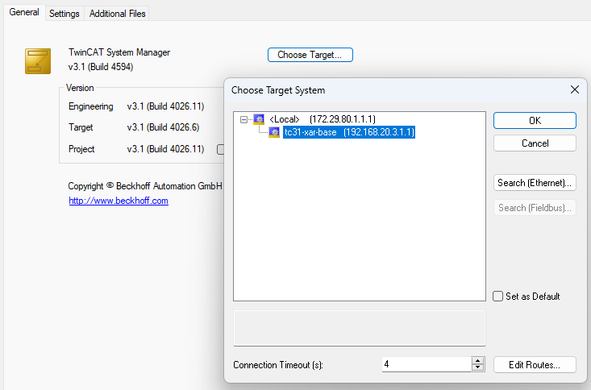

# About this repository

This repository provides a sample setup for creating and running a Docker container with a TwinCAT 3.1 XAR environment.
The repository includes all necessary files to build the Docker image and run it using Docker Compose.

# How to get support

Should you have any questions regarding the provided sample code, please contact your local Beckhoff support team. Contact information can be found on the official Beckhoff website at https://www.beckhoff.com/contact/.

# Using the sample

To use the sample, simply follow these steps:

1. Inform yourself about TwinCAT for Linux® via your local Beckhoff support team.
2. Ensure to have a supported Beckhoff IPC with the latest version of the Beckhoff Real-Time Linux® Distribution installed.
3. Follow the instructions on [Docker Engine on Debian](https://docs.docker.com/engine/install/debian/#install-using-the-repository) to install Docker as container management software
4. [Build the container image](#building-the-docker-image) via `sudo make build-image`
5. [Create firewall rules](#firewall-rules-for-mqtt-connections) to allow [connections via ADS over MQTT](#connection-via-ads-over-mqtt)
6. [Create and run the container setup](#running-the-container) via `sudo make run-containers`
7. On your TwinCAT Engineering station, adjust your ADS-Routes to [establish a connection between TwinCAT XAR and the container](#establish-a-ads-over-mqtt-connection-between-twincat-xae-and-xar)
8. Configure the network interfaces [for real-time Ethernet communication](#configure-the-host-for-real-time-ethernet-communication)

## Detailed information about the sample

### Repository structure

The repository is organized as follows:

- `docker-compose.yaml`: Sample to define the run configuration for the containers
- `Makefile`: Used to simplify and automate common Docker tasks.
- `simple-mosquitto.conf`: Simple configuration file for Mosquitto MQTT broker used for ADS over MQTT
- `tc31-xar-base/`: Contains all required files to build a Docker image for a TwinCAT 3.1 XAR environment
    - `Dockerfile`: Defines the instructions to build the Docker image.
    - `TwinCAT/`
        - `StaticRoutes.xml`: Sample configuration to use ADS over MQTT
        - `TcRegistry.xml`: Sample set of TwinCAT XAR configuration
    - `apt-config/`
        - `bhf.conf`: Template for authentication against beckhoff.com package server
        - `bhf.list`: apt source list sample for Beckhoff package repo
        - `debian.sources.list`: apt source list for Beckhoff Debian mirror
    - `entrypoint.sh`: Script used as entrypoint to start TcSystemServiceUm on container start

### Makefile Summary

The `Makefile` in this repository is used to simplify and automate common Docker tasks in this sample.
It includes the following targets:

- `build-image`: Builds the Docker image using the Dockerfile located in the `tc31-xar-base` directory.
- `push-image`: Pushes the built Docker image to a specified Docker registry.
- `run-containers`: Starts the containers defined in the `docker-compose.yaml` file.
- `list-containers`: Lists the running containers managed by Docker Compose.
- `stop-and-remove-containers`: Stops and removes all containers defined in the `docker-compose.yaml` file.
- `container-logs`: Displays the logs of the running containers.

The `Makefile` uses variables to define the image name, tag, and registry, allowing for easy customization.

You can install `make` on your host via:

```
sudo apt install make
```

## Building the Docker Image

During the image build process TwinCAT for Linux® will be loaded as package from `https://deb.beckhoff.com`.

Before you build the image, ensure to insert valid mybeckhoff credentials by replacing `<mybeckhoff-mail>` and `<mybeckhoff-password>` inside `./tc31-xar-base/apt-config/bhf.conf`.

Afterwards you can use the `Makefile` for building the image.

```
sudo make build-image
```

Alternatively, navigate to `tc31-xar-base` of the repository and run the following command:

```sh
sudo docker build --network host -t tc31-xar-base .
```

The `tc31-xar-base` subfolder contains all the necessary files and configurations required to build a Docker image for a TwinCAT 3.1 XAR environment.
The intention of this subfolder is to provide a self-contained build context for creating a Docker image that can run TwinCAT applications.

## Connection via ADS over MQTT

The sample is intended to use [ADS-over-MQTT](https://infosys.beckhoff.com/english.php?content=../content/1033/tc3_grundlagen/4058167819.html&id=) to connect your TwinCAT 3.1 XAE environment to the `tc31-xar-base` container.

Therefore, the eclipse-mosquitto MQTT message broker will be used as message broker between TwinCAT 3.1 XAE engineering environment and the `tc31-xar-base` container.

In the following section [Running the Container](#running-the-container) we will use `docker compose` in combination with the [`docker-compose.yaml`](./docker-compose.yaml) file to setup a `eclipse-mosquitto` and a `tc31-xar-base` container.

At this point it is important to consider the network connections between the container, their container host and the XAE host as depict in the follonwing figure:



`docker` takes over host and container network configuration (shown in blue).
Among other thinks, docker uses `iptables` to handle masquerading and forwarding of connection requests between MQTT clients (TwinCAT XAE and XAR) and the MQTT broker running in the mosquitto container.

However, additional configuration is needed to also allow and forward network connections via `nftables`, the default firewall on the Beckhoff Linux® distribution (shown in red). 

### Firewall rules for MQTT connections

To allow incoming network connections to tcp port 1883 for MQTT clients create the file `/etc/nftables.conf.d/60-mosquitto-container.conf` with the following content:

```
sudo nano /etc/nftables.conf.d/60-mosquitto-container.conf
```

```
table inet filter {
    chain forward {
        type filter hook forward priority 0; policy drop;

        # Allow forwarding of packets with TCP source port 1883
        tcp sport 1883 accept

        # Allow forwarding of packets with TCP destination port 1883
        tcp dport 1883 accept
    }
}
```

Afterwards run `sudo nft -f /etc/nftables.conf.d/60-mosquitto-container.conf` to apply the additional rule set.

## Running the Container

You can use the `run-containers` make target to run the container using Docker Compose:

```
# sudo make run-containers 
docker compose up -d
[+] Running 3/3
   Network container-network  Created    0.3s 
   Container mosquitto        Started    1.2s 
   Container tc31-xar-base    Started    1.2s 
```

According to `docker-compose.yaml`, this command will start the containers `tc31-xar-base` and `mosquitto` in the defined container network `container-network` on the host.

To check the status of the containers run:

```
# sudo make list-containers 
docker compose ps
NAME            IMAGE               COMMAND                  SERVICE         CREATED              STATUS              PORTS
mosquitto       eclipse-mosquitto   "/docker-entrypoint.…"   mosquitto       About a minute ago   Up About a minute   0.0.0.0:1883->1883/tcp, :::1883->1883/tcp
tc31-xar-base   tc31-xar-base       "/bin/sh /app/entryp…"   tc31-xar-base   About a minute ago   Up About a minute   8016/tcp, 48898/tcp, 48899/udp
```

## Establish a ADS-over-MQTT connection between TwinCAT XAE and XAR 

On your TwinCAT 3.1 XAE engineering station you can use the `mqtt.xml` template for the ADS-Over-MQTT route configuration.
Simply adjust the address inside the `mqtt.xml` file and copy the file to `C:\Program Files (x86)\Beckhoff\TwinCAT\3.1\Target\Routes\`.
After a restart of your TwinCAT System Serice, the conatinerized TwinCAT Runtime `tc31-xar-base` should be listed as available target system:




## Configure the host for real-time Ethernet communication

Real-time Ethernet communication is supported only on the latest Beckhoff IPCs.
For these IPCs, the `vfio-pci` kernel module must be used as the driver for the Ethernet controller intended for real-time communication.

To easily assign the `vfio-pci` driver to supported Ethernet controllers, you can use the `tcrteinstall` package (in older beta versions included in the package `libtrcte`).

```
sudo apt install tcrteinstall # libtcrte alternatively
```

Once the package is installed, you can use the `TcRteInstall` tool to assign the `vfio-pci` driver to the Ethernet controllers.
For more information, refer to `TcRteInstall -h`.

**Example**

For example, running sudo `TcRteInstall -l` might produce the following output:

```
sudo TcRteInstall -l
No   Name       MAC                Location       Driver     Override   Model                                             
0    enp3s0     00:01:05:9d:43:21  0000:03:00.0   igc        [-]        Ethernet Controller I226-IT                       
1    enp2s0     00:01:05:9d:43:20  0000:02:00.0   igc        [-]        Ethernet Controller I226-IT  
```

To assign the `vfio-pci` driver to the `enp3s0` interface, use the following command:

```
sudo TcRteInstall -b 0000:03:00.0
```

You can verify the result by listing the interfaces again with `sudo TcRteInstall -l`:

```
sudo TcRteInstall -l
No   Name       MAC                Location       Driver     Override   Model                                             
0    enp3s0     unknown            0000:03:00.0   vfio-pci   [*]        Ethernet Controller I226-IT                       
1    enp2s0     00:01:05:9d:43:20  0000:02:00.0   igc        [-]        Ethernet Controller I226-IT
```
